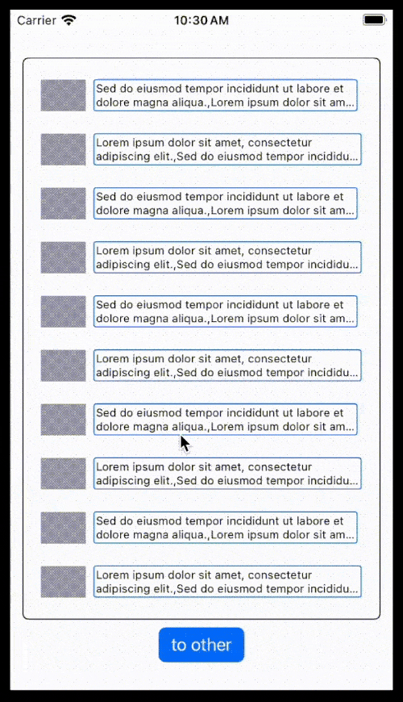
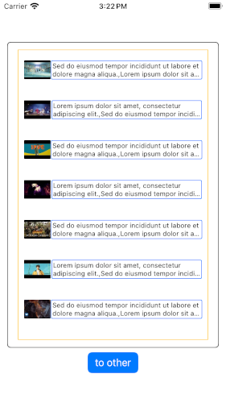

### Contents

Package provides six main things
1. `EasyThumbs` view, which displays a list of row views with thumbnail image + detail text
2. Customizable row detail view which receives `ThumbData`
3. Background `task` to download image urls in a collection of `ThumbData`
4. Built-in caching of the downloaded images
5. Above list can be made selectable for single/multiple selections
6. List can be refreshed using `onRefresh` callback, and it can be filtered using `filterQuery` binding

### Usage

As seen in the `EasyThumbsExampleApp`, the `EasyThumbs` view needs be initialized
with a collection of url strings, followed by a collection of detail strings, and
a `selectionMode` with `selections` state (to make the list selectable)

    EasyThumbs(
        urls: EasyThumbsExampleAppConstants.ytUrls,
        details: EasyThumbsExampleAppConstants.loremSentences,
        selectionMode: .single, selections: $selections, filterQuery: $searchQuery) { thumbData in
        Text(thumbData.detail!.joined(separator: ","))
            .font(.system(size: 11))
            .lineLimit(2).truncationMode(.tail).multilineTextAlignment(.leading)
            .padding([.all],2)
            .overlay(RoundedRectangle(cornerRadius: 2).stroke(Color.blue))
    }

The `closure` at the end receives a value of type `ThumbData`. This value can be used to customize
the row detail view. The complete list of initialization parameters are described as following.

- urls: `[String]`
- details: `[[String]]` = []
- parentSize: `CGSize` = CGSize(width: 350, height: 505)
- contentRowSize: `CGSize` = CGSize(width: 250, height: 44)
- imageSize: `CGSize` = CGSize(width: 44, height: 31)
- imageScaleFactor: `CGFloat` = 1
- imageClipShapeRadius: `CGFloat` = 1
- contentSpacing: `CGFloat` = 1
- rowColor: `Color` = Color.white
- scrollIndicatorVisibility: `ScrollIndicatorVisibility` = .hidden
- selectionColor: `Color` = Color.green
- selectionMode: `SelectionMode` = .none
- selections: `Binding<[Int]>`
- filterQuery: `Binding<String>`
- onRefresh: `callback?`
- content: `@escaping (ThumbData) -> any View)`

#### Description

- **urls**: An array of strings representing URLs.
- **details**: A 2D array of strings containing additional details.
- **parentSize**: The size of the parent container.
- **contentRowSize**: The size of each content row.
- **imageSize**: The size of image view.
- **imageScaleFactor**: A scaling factor for images.
- **imageClipShapeRadius**: The radius of rectangular corners for the clip shape.
- **contentSpacing**: Spacing between thumbnail and detail.
- **rowColor**: The background color for the entire list row.
- **scrollIndicatorVisibility**: Visibility of vertical scroll indicator.
- **selectionColor**: The color of the selection border.
- **selectionMode**: Selection mode of the list (none, single, multiple).
- **selections**: The binding to the `@State` collection of selected index/indices.
- **filterQuery**: The binding to the `@State` string for filtering `cachedThumbs`.
- **onRefresh**: A callback that gets invoked when the list is refreshed.
- **content**: A closure that generates a view based on `ThumbData`.

#### Debugging

> Debugging can be turned on by setting `EasyThumbs.debug`. Its default value is `false`, and running
> the example app will print the following logs, after successful caching of urls defined in `ytUrls`.

	listCache:
	#1 Library/Caches/ImageCache/.DS_Store
	#2 Library/Caches/ImageCache/aHR0cHM6Ly9pLnl0aW1nLmNvbS92aS9EXzZRbUw2ckV4ay9kZW
	...
	#10 Library/Caches/ImageCache/aHR0cHM6Ly9pLnl0aW1nLmNvbS92aS83QzJ6NEdxcVM1RS9kZW
	#11 Library/Caches/ImageCache/aHR0cHM6Ly9pLnl0aW1nLmNvbS92aS9PSzNHSjBXSVE4cy9kZW
	read-cache: aHR0cHM6Ly9pLnl0aW1nLmNvbS92aS83QzJ6NEdxcVM1RS9kZW
	read-cache: aHR0cHM6Ly9pLnl0aW1nLmNvbS92aS9rVGx2NV9Cczhhdy9kZW
	...
	read-cache: aHR0cHM6Ly9pLnl0aW1nLmNvbS92aS9KMkh5dEh1NVZCSS9kZW
	read-cache: aHR0cHM6Ly9pLnl0aW1nLmNvbS92aS9EXzZRbUw2ckV4ay9kZW

#### Details

Cached filenames are unique string filenames generated from thumbnail urls using the following method.

    private func networkUrlToCacheFilename(_ networkUrl: URL) -> String? {
        let imgDiskUrl = networkUrl.absoluteString
        guard let base64String = imgDiskUrl.data(using: .utf8)?.base64EncodedString() else {
            return nil
        }
        let endIndex = base64String.index(base64String.startIndex, offsetBy: base64String.count - EasyThumbsConstants.base64StringSkipTrailingCount)
        return String(base64String[base64String.startIndex...endIndex])
    }

### Platforms

- macOS v13 and above
- iOS v16 and above

### Example

#### Default and Customized Styling

    
    

#### Details

The example app uses a `NavigationStack` to embed two views - rootView, otherView. For the
purpose of explanation, let us call them screens. The first screen contains a `VStack` with
an `EasyThumbs` view and a `Button` view for navigation. At the start of the example demo
there is no internet connection on the emulator, so the `Image` loads a gray bitmap as a
placeholder.

    let data = Data(url: thumbData.url) // with placeholder bitmap
    Image(uiImage: UIImage(data: data)!)

Upon enabling the internet connection, and navigating back to the first screen, the background `task`
to download the images gets executed, and so, the thumbnails get displayed.

### Troubleshooting

Preview on Xcode with PreviewProvider cannot access local file storage easily. If it gives an error
related to the following

> Error Domain=NSCocoaErrorDomain Code=4 "The file “ImageCache” doesn’t exist."
> UserInfo={NSFilePath=/Users/full/path/to/Library/Caches/ImageCache, NSUnderlyingError=0x600000c1c600
> {Error Domain=NSPOSIXErrorDomain Code=2 "No such file or directory"}}

then create the required folder using the `mkdir -p` command. Please note that this step is not required
at all (i.e. there are no issues) if `EasyThumbs` view is used in an actual app, and executed on the simulator
or a real device. So, if the above issue persists in the preview mode, please switch to the latter.